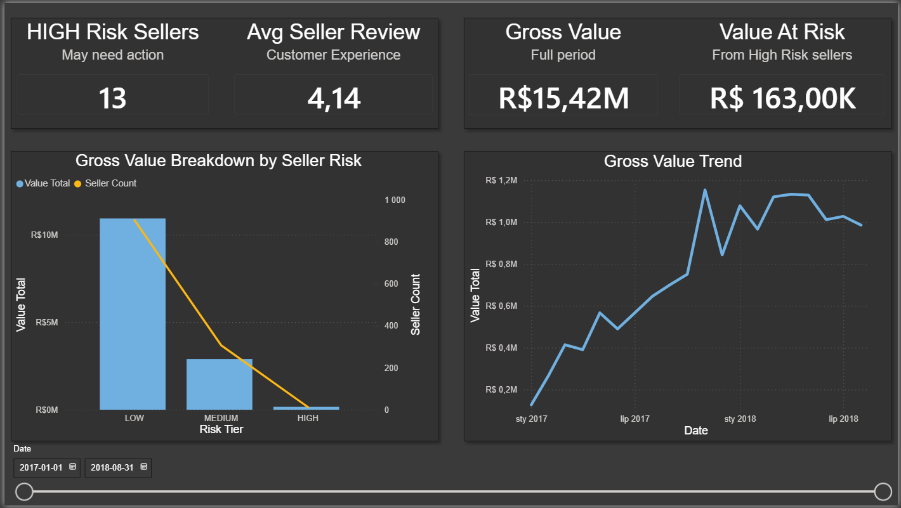

# Olist Marketplace Risk Analytics
**Stack:** PostgreSQL · Power BI · DAX  
**Dataset:** [Olist Brazilian E-Commerce](https://www.kaggle.com/datasets/olistbr/brazilian-ecommerce) · Kaggle · CC BY-NC-SA 4.0  
**Scope:** 99,441 orders · 3,095 sellers · Jan 2017 – Aug 2018

---

## What This Project Does

On a multi-seller marketplace, a bad seller ships under the platform brand. The customer leaves a 1-star review. The platform absorbs the damage.

This project builds a seller risk scoring system on top of the Olist public dataset — identifying which sellers pose operational risk, how much value flows through them, and which product categories are most exposed.

---

## Key Numbers

| | |
|---|---|
| Gross Merchandise Value (GMV) | R$ 15.42M |
| HIGH-risk sellers | 13 of 3,095 |
| Value at risk | R$ 163K (1.06%) |
| Avg review score | 4.14 / 5.00 |
| On-time delivery | 90% |
| Late delivery → low reviews | strong confirmed correlation |

> **Note on GMV vs. revenue:** The R$ 15.42M figure represents Gross Merchandise Value — the sum of item prices and freight paid by buyers. It does not represent Olist's platform revenue, which would require deducting seller fees and commissions (not available in this dataset). All monetary metrics in this project are GMV-based.

---

## Business Insights

**The Pareto rule holds — and risk doesn't follow value.**  
The top 17.8% of sellers (550 of 3,095) generate 80% of platform value. The top 4.3% (132 sellers) generate 50%. That's a highly concentrated value base.

But the 13 HIGH-risk sellers are not in that top group. They average R$ 12,641 each — comparable to LOW-risk sellers. The larger threat sits in MEDIUM: 134 MEDIUM-risk sellers are inside the top 20% of the Pareto curve, collectively holding R$ 2.45M in value. The two highest-value sellers on the platform (R$ 245K and R$ 239K each) are both MEDIUM.

**The category with the most exposure is `auto`.**  
6.83% of auto category value flows through HIGH-risk sellers — the highest of any named category. `watches_gifts` (2.0%) and `sports_leisure` (1.9%) follow.

**Late delivery and low reviews move together — but not perfectly.**  
Spearman r = −0.46 confirms the relationship is real and consistent. Sellers with 0–5% late deliveries average 4.33 stars; sellers above 30% average 3.25. But the correlation is moderate, not deterministic — a handful of sellers with 20%+ late rates still hold reviews above 4.0. Those are not intervention candidates.

---

## Dashboard



*Page 1 — Platform Health: KPI cards, value by risk tier, monthly value trend. Date slicer (Jan 2017–Aug 2018). HIGH Risk Sellers and Value At Risk are isolated from the slicer — risk tier is a cumulative seller profile, not a period metric.*


*Page 2 — Distribution & Pareto: review score and late delivery distributions, Pareto curve with 50% and 80% reference lines, Spearman r = −0.46, on-time delivery rate.*


*Page 3 — Risk Deep Dive: scatter plot by tier (HIGH/MEDIUM/LOW), category × risk tier heatmap, HIGH-risk seller table. Category slicer filters scatter and table.*

---

## Architecture

```
Data/  →  PostgreSQL (raw tables, never modified)
             │
         Staging        stg_reviews · stg_orders · stg_order_items · stg_products
             │
         Intermediate   int_order_facts (1 row/order) · int_seller_metrics (1 row/seller)
             │
         Marts          mart_seller_risk · mart_revenue_concentration
                        mart_category_risk · mart_seller_correlation
             │
         BI/  →  Power BI (Import mode, DAX measures, Calendar table)
```

---

## Technical Highlights

### Primary seller assignment

Orders on Olist can have multiple sellers. `int_order_facts` assigns each order to the seller with the highest value contribution using `ROW_NUMBER()`. A simple `GROUP BY` would either lose data or create duplicates.

```sql
WITH seller_rank AS (
  SELECT
    oi.order_id, oi.seller_id,
    SUM(oi.total_item_revenue) AS seller_revenue,
    ROW_NUMBER() OVER (
      PARTITION BY oi.order_id
      ORDER BY SUM(oi.total_item_revenue) DESC, oi.seller_id
    ) AS seller_rn
  FROM stg_order_items oi
  GROUP BY oi.order_id, oi.seller_id
)
SELECT order_id, seller_id FROM seller_rank WHERE seller_rn = 1
```

### WATCH as a guard clause

Sellers with fewer than 10 delivered orders get WATCH — evaluated before HIGH or MEDIUM. A 1-star average on 3 orders is noise, not a signal. Flagging these sellers HIGH would pollute the tier with unreliable data.

```sql
CASE
  WHEN delivered_orders < 10                                      THEN 'WATCH'
  WHEN avg_review_score < 3.0
    OR (late_delivery_rate > 0.30 AND avg_review_score < 3.5)    THEN 'HIGH'
  WHEN late_delivery_rate > 0.10 OR avg_review_score < 3.8       THEN 'MEDIUM'
  ELSE 'LOW'
END AS risk_tier
```

WATCH sellers are also excluded from the Spearman correlation (`mart_seller_correlation` filters to `delivered_orders >= 10`). Same principle: don't run statistics on insufficient samples.

### `is_late` bug catch

`order_estimated_delivery_date` is stored as a timestamp at `00:00:00`. Comparing it directly to `order_delivered_customer_date` marked 1,292 on-time deliveries as late — anything arriving after midnight on the estimate date failed the check.

```sql
-- Before
o.order_delivered_customer_date > o.order_estimated_delivery_date

-- After
o.order_delivered_customer_date::date > o.order_estimated_delivery_date::date
```

Impact: 3 sellers moved out of HIGH. Value at risk corrected from R$ 177,279 → R$ 163,000.

### Spearman r in DAX

Spearman is Pearson applied to ranks. Rank columns are calculated columns on `mart_seller_correlation` using `RANKX(ALL(...), ..., ASC, Dense)`.

```dax
Spearman r =
VAR MeanR = AVERAGE(mart_seller_correlation[rank_review_score])
VAR MeanD = AVERAGE(mart_seller_correlation[rank_late_delivery])
VAR Num   = SUMX(mart_seller_correlation,
              (mart_seller_correlation[rank_review_score] - MeanR) *
              (mart_seller_correlation[rank_late_delivery] - MeanD))
VAR DenR  = SQRT(SUMX(mart_seller_correlation, POWER(mart_seller_correlation[rank_review_score] - MeanR, 2)))
VAR DenD  = SQRT(SUMX(mart_seller_correlation, POWER(mart_seller_correlation[rank_late_delivery] - MeanD, 2)))
RETURN DIVIDE(Num, DenR * DenD)
```

This supports the assumption behind the risk model — that delivery quality and customer experience degrade together. It does not validate the tier thresholds, which are business decisions documented in the Risk tier threshold rationale section below.

### Risk tier threshold rationale

Thresholds in `mart_seller_risk` are grounded in the actual distribution of seller performance metrics, filtered to sellers with `delivered_orders >= 10` (n = 1,222).

```sql
SELECT
    ROUND(PERCENTILE_CONT(0.25) WITHIN GROUP (ORDER BY avg_review_score)::numeric, 2)    AS p25_review,
    ROUND(PERCENTILE_CONT(0.50) WITHIN GROUP (ORDER BY avg_review_score)::numeric, 2)    AS p50_review,
    ROUND(PERCENTILE_CONT(0.75) WITHIN GROUP (ORDER BY avg_review_score)::numeric, 2)    AS p75_review,
    ROUND(PERCENTILE_CONT(0.25) WITHIN GROUP (ORDER BY late_delivery_rate)::numeric, 4)  AS p25_late,
    ROUND(PERCENTILE_CONT(0.50) WITHIN GROUP (ORDER BY late_delivery_rate)::numeric, 4)  AS p50_late,
    ROUND(PERCENTILE_CONT(0.75) WITHIN GROUP (ORDER BY late_delivery_rate)::numeric, 4)  AS p75_late
FROM int_seller_metrics
WHERE delivered_orders >= 10;
```

| Metric | P25 | P50 | P75 |
|---|---|---|---|
| avg_review_score | 4.00 | 4.23 | 4.42 |
| late_delivery_rate | 0.0167 | 0.0556 | 0.0926 |

**Review score thresholds:**
- `HIGH < 3.0` — bottom tail, clear underperformers well below P25
- `MEDIUM < 3.8` — below P25, conservative floor for underperforming sellers

**Late delivery thresholds:**
- `MEDIUM > 0.10` — above P75, elevated vs peers
- `HIGH > 0.30` — over 3× above P75, severe outlier

Thresholds are intentionally conservative — designed to flag only clear outliers, not marginal underperformers. The dual-failure condition for HIGH (`late_delivery_rate > 0.30 AND avg_review_score < 3.5`) requires both dimensions to deteriorate simultaneously, reducing false positives.

---

## Recommendations

**13 HIGH-risk sellers should be reviewed for delisting.** Priority order by value at risk: `auto` (R$ 45,748), `watches_gifts` (R$ 25,414), `sports_leisure` (R$ 21,110). The delist case is strongest where both review score and late delivery breach thresholds simultaneously — that dual-failure pattern is more reliable than either metric alone.

**MEDIUM tier warrants more attention than HIGH.** 134 MEDIUM sellers sit inside the top 20% of the Pareto curve, holding R$ 2.45M combined — including the two highest-value sellers on the platform. Consider setting escalation thresholds: MEDIUM sellers exceeding 10% late delivery rate over a sustained period should move to HIGH for review.

**`auto` category needs a seller-level quality check.** 6.83% of its value flows through HIGH-risk sellers — highest of any named category. Given the concentration, this is worth addressing at the category onboarding level, not just case by case.

**Late delivery alone is not sufficient grounds for intervention.** Five sellers with late delivery above 20% hold average review scores above 4.0 — their customers are not penalising them for it. Any intervention framework should require both dimensions to deteriorate before escalating, consistent with how the HIGH tier is defined.

---

## Setup

```sql
-- Run in order — stg_reviews must be first
\i SQL/staging/stg_reviews.sql
\i SQL/staging/stg_orders.sql
\i SQL/staging/stg_order_items.sql
\i SQL/staging/stg_products.sql
\i SQL/staging/stg_sellers.sql
\i SQL/intermediate/int_order_facts.sql
\i SQL/intermediate/int_seller_metrics.sql
\i SQL/marts/mart_seller_risk.sql
\i SQL/marts/mart_revenue_concentration.sql
\i SQL/marts/mart_category_risk.sql
\i SQL/marts/mart_seller_correlation.sql
```

Power BI: Home → Get Data → PostgreSQL → `localhost / olist` → Import  
Tables: `mart_seller_risk`, `mart_revenue_concentration`, `mart_category_risk`, `mart_seller_correlation`, `int_order_facts`

---

## Project Structure

```
olist-marketplace-risk/
├── BI/                 Power BI report (.pbix) and screenshots
├── Data/               Raw Olist CSV files
├── SQL/
│   ├── setup/          01_data_audit.sql
│   ├── staging/        stg_reviews · stg_orders · stg_order_items · stg_products · stg_sellers
│   ├── intermediate/   int_order_facts · int_seller_metrics
│   └── marts/          mart_seller_risk · mart_revenue_concentration · mart_category_risk · mart_seller_correlation
└── README.md
```

---

*Olist Brazilian E-Commerce Public Dataset · Kaggle · CC BY-NC-SA 4.0*
