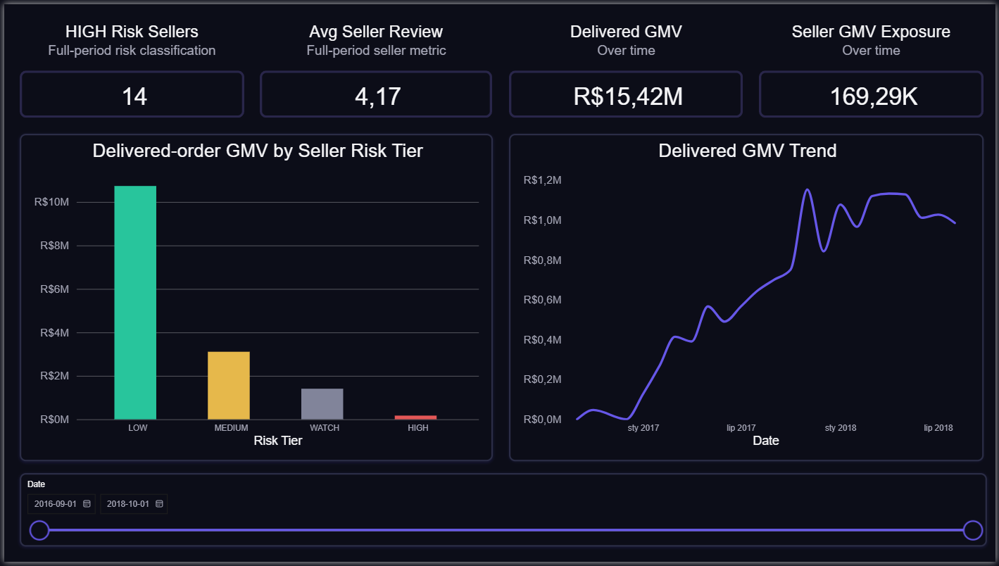
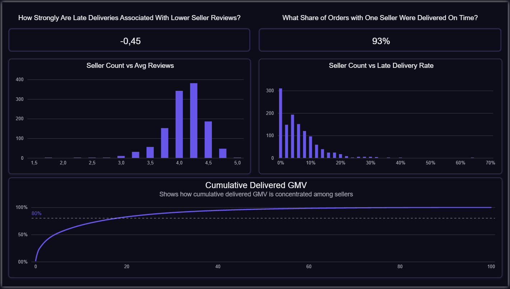
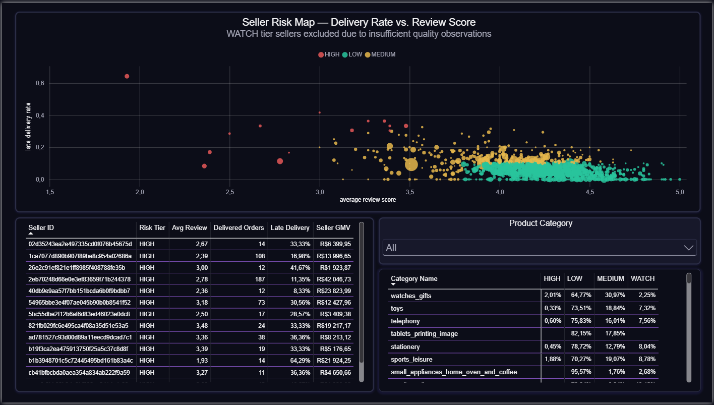

# Olist Marketplace Risk Analytics

**Stack:** PostgreSQL · Power BI · DAX · Python · pandas · SciPy  
**Dataset:** [Olist Brazilian E-Commerce](https://www.kaggle.com/datasets/olistbr/brazilian-ecommerce) · Kaggle · CC BY-NC-SA 4.0  
**Scope:** 99,441 orders · 3,095 sellers · source records from Sep 2016 to Oct 2018

---

## What This Project Does

On a multi-seller marketplace, customers interact with the platform as one brand, even when an order is fulfilled by different sellers. Poor delivery performance or weak seller quality can therefore create platform-level customer experience risk.

This project builds a rule-based seller risk framework on the Olist public e-commerce dataset. It answers four practical questions:

- Which sellers show the weakest combination of delivery and review performance?
- How much delivered GMV is associated with each seller risk tier?
- How concentrated is marketplace value across sellers?
- Which product categories are most exposed to higher-risk sellers?

The analysis uses separate grains for order, seller-order and order-item questions to keep seller GMV correctly attributed and additive.

---

## Key Numbers

| Metric | Result |
|---|---:|
| Delivered-order GMV | **R$15.42M** |
| Seller population | **3,095** |
| HIGH-risk sellers | **14** |
| HIGH-Risk Seller GMV Exposure | **R$169.29K** |
| HIGH-risk share of delivered GMV | **1.10%** |
| On-time rate in one-seller orders used for delivery-quality analysis | **93.15%** |
| Sellers included in correlation analysis | **1,214** |
| Spearman correlation: late-delivery rate vs review score | **ρ = -0.45** |
| Sellers required to reach 80% of delivered GMV | **551 / 3,095 (17.8%)** |

> **GMV definition:** GMV is item price plus freight value for delivered orders with a recorded customer delivery date. Olist platform revenue would require seller fees and commissions, which are unavailable in the dataset.

---

## Analytical Design

A central part of the project is using the correct grain for each business question.

### 1. Order grain

`int_order_facts` contains one row per `order_id` and supports platform-level metrics such as delivered GMV and GMV trend.

```text
1 row = 1 order
```

### 2. Seller-order grain

`int_seller_order_facts` contains one row per seller participating in an order.

```text
1 row = order_id × seller_id
```

Each seller receives only the GMV generated by that seller's own items:

```sql
SELECT
    order_id,
    seller_id,
    SUM(item_gmv)::NUMERIC(14,2) AS seller_order_gmv,
    COUNT(*) AS seller_item_count
FROM stg_order_items
GROUP BY order_id, seller_id;
```

This makes seller GMV additive even when one order contains products from multiple sellers.

### 3. Order-item grain for category risk

Category exposure is calculated from the actual product and seller attached to every delivered order item:

```text
order item
    → actual seller
    → actual product
    → translated category
    → seller risk tier
```

This avoids assigning an entire multi-seller or multi-category order to a single seller or category.

---

## Seller Quality Attribution

Olist records one final delivery date and one review score for the whole **order**. Seller-specific delivery and review outcomes are unavailable.

For a multi-seller order, the source data provides no seller-level attribution for a late delivery or a poor review. For that reason:

- **GMV metrics include multi-seller orders**, because each item has a known seller.
- **Seller review and delivery-quality metrics use only one-seller orders**, where the outcome can be attributed defensibly to that seller.

The seller-order table therefore carries explicit eligibility flags:

```sql
(sc.seller_count_in_order = 1) AS is_single_seller_order,

(
    o.order_status = 'delivered'
    AND o.order_delivered_customer_date IS NOT NULL
    AND o.order_estimated_delivery_date IS NOT NULL
    AND sc.seller_count_in_order = 1
) AS is_delivery_quality_eligible,

(
    o.order_status = 'delivered'
    AND o.order_delivered_customer_date IS NOT NULL
    AND sc.seller_count_in_order = 1
    AND r.avg_review_score IS NOT NULL
) AS is_review_quality_eligible
```

Missing reviews are excluded from review-quality denominators.

---

## Seller Risk Logic

The risk model is a transparent rule-based business framework.

```sql
CASE
    WHEN delivery_quality_orders < 10
      OR review_quality_orders < 10
      OR avg_review_score IS NULL
      OR late_delivery_rate IS NULL
        THEN 'WATCH'

    WHEN avg_review_score < 3.0
      OR (
            late_delivery_rate > 0.30
            AND avg_review_score < 3.5
         )
        THEN 'HIGH'

    WHEN late_delivery_rate > 0.10
      OR avg_review_score < 3.8
        THEN 'MEDIUM'

    ELSE 'LOW'
END AS risk_tier
```

`WATCH` is evaluated first, keeping sellers with insufficient quality history outside the best classification.

### Risk-tier distribution

| Risk Tier | Sellers | Delivered GMV | Share of Delivered GMV |
|---|---:|---:|---:|
| HIGH | 14 | R$169.29K | 1.10% |
| MEDIUM | 304 | R$3.11M | 20.15% |
| LOW | 896 | R$10.73M | 69.62% |
| WATCH | 1,881 | R$1.41M | 9.13% |

Cancellation rate is retained as a descriptive metric and stays outside the current risk-tier thresholds.

---

## Business Insights

**Marketplace value is highly concentrated across sellers.**  
The top **551 sellers (17.8%) generate 80% of delivered GMV**, while only **132 sellers (4.3%) generate 50%**. This concentration means a relatively small seller group represents a large share of marketplace value.

**HIGH-risk sellers represent a small share of GMV, but the MEDIUM tier carries much more value.**  
HIGH-risk sellers account for **1.10%** of delivered GMV, while MEDIUM sellers account for **20.15%**. Operational monitoring should therefore include both HIGH and economically important MEDIUM sellers.

**`auto` has the highest HIGH-risk GMV share among translated product categories.**  
Approximately **6.84%** of delivered GMV in the `auto` category is associated with HIGH-risk sellers. The category view is calculated directly from order items and actual seller IDs.

**Late delivery and seller reviews show a moderate relationship.**  
For the **1,214 sellers** with sufficient delivery and review observations, Spearman **ρ = -0.45** with **p < 0.001**. Sellers with higher late-delivery rates tend to have lower review scores. The result describes association; causal inference is outside the scope of this analysis.

---

## Dashboard

### Page 1 — Platform Health Overview



The overview combines seller-risk KPIs with delivered GMV by risk tier, the delivered GMV trend and a date slicer.

---

### Page 2 — Seller Distribution & Pareto Analysis



This page shows the distributions of average seller reviews and late-delivery rates, the delivery/review association, the on-time delivery rate and seller-value concentration.

#### Why is this called Pareto Analysis?

The **Pareto principle**, often called the **80/20 rule**, is a heuristic stating that a large share of an outcome can often be concentrated in a relatively small share of contributors. The 80/20 split is a reference pattern rather than a fixed rule.

In this project, sellers are ranked from highest to lowest delivered GMV. The Pareto curve then plots:

```text
cumulative % of sellers
        vs
cumulative % of delivered GMV
```

The data reaches **80% of delivered GMV after 17.8% of sellers**, which is close to the classical 80/20 pattern. Page 2 uses Pareto analysis to show **value concentration** and compare the observed distribution with that reference pattern.

The ordering is deterministic:

```sql
ROW_NUMBER() OVER (
    ORDER BY seller_gmv DESC, seller_id
) AS revenue_rank
```

The `seller_id` tie-breaker keeps ranking results stable when sellers have equal GMV.

---

### Page 3 — Seller Risk Deep Dive



The deep-dive page contains:

- a seller risk map comparing late-delivery rate with average review score,
- a table of seller-level risk metrics,
- product-category GMV mix by risk tier,
- a product-category slicer for the category analysis.

`WATCH` sellers are excluded from the risk map because they lack enough quality observations for the HIGH / MEDIUM / LOW comparison.

The category mart is intentionally kept separate from global seller-level filtering, which prevents invalid cross-grain seller metrics when a category is selected.

---

## Spearman Correlation in Python

The statistical coefficient is calculated with SciPy.

`mart_seller_correlation` prepares one eligible row per seller:

```sql
SELECT
    seller_id,
    delivery_quality_orders,
    review_quality_orders,
    late_delivery_rate,
    avg_review_score
FROM int_seller_metrics
WHERE delivery_quality_orders >= 10
  AND review_quality_orders >= 10
  AND late_delivery_rate IS NOT NULL
  AND avg_review_score IS NOT NULL;
```

The exported seller table is then analyzed in `scripts/seller_correlation.py`:

```python
from scipy.stats import spearmanr

rho, p_value = spearmanr(
    df["late_delivery_rate"],
    df["avg_review_score"],
)
```

The script validates the input grain and analytical columns before saving a one-row result to:

```text
data/py/spearman_result.csv
```

Current result:

```text
eligible_sellers = 1214
spearman_rho     = -0.454332
p_value          = 7.149085e-63
```

---

## Delivery-Date Rule

Olist stores the estimated delivery timestamp at midnight. Lateness is evaluated at **calendar-date level**:

```sql
o.order_delivered_customer_date::date
    > o.order_estimated_delivery_date::date
```

An order delivered later during its estimated delivery date is still treated as on time.

---

## Architecture

```text
data/raw/*.csv
      │
      ▼
PostgreSQL raw tables
      │
      ▼
Staging
stg_orders · stg_order_items · stg_products · stg_reviews
      │
      ▼
Intermediate
int_order_facts
int_seller_order_facts
int_seller_metrics
      │
      ├───────────────┬──────────────────┬────────────────────┐
      ▼               ▼                  ▼                    ▼
mart_seller_risk   mart_revenue_      mart_category_risk   mart_seller_
                   concentration                           correlation
                                                               │
                                                               ▼
                                                     Python / SciPy
                                                               │
                                                               ▼
                                                     spearman_result.csv
      │
      └──────────────────────────────────────────────────────────┐
                                                                 ▼
                                                              Power BI
```

---

## Power BI Data Model

The active analytical relationships are intentionally simple:

```text
Calendar[Date]
    1 → * int_order_facts[order_year_month]

Calendar[Date]
    1 → * int_seller_order_facts[order_year_month]

mart_seller_risk[seller_id]
    1 → * int_seller_order_facts[seller_id]
```

Purpose-built analytical marts such as category risk, revenue concentration and correlation remain disconnected when no valid cross-grain filtering is required.

This prevents Power BI relationships from recreating seller/category fan-out or unintentionally filtering the full seller population through the smaller correlation sample.

---

## Validation

The project includes raw-data and model-level QA in `sql/validation/`.

Key validation results:

```text
int_order_facts
99,441 rows / 99,441 unique orders

int_seller_order_facts
100,010 unique order × seller rows
97,811 delivered seller-order rows

seller population
3,095 sellers

Delivered GMV reconciliation
order grain        = R$15,418,394.83
seller-order grain = R$15,418,394.83
seller grain       = R$15,418,394.83
category grain     = R$15,418,394.83

Spearman input
1,214 eligible sellers
```

The validation layer checks that:

- `order_id` remains unique at order grain,
- `order_id + seller_id` remains unique at seller-order grain,
- no seller GMV is lost or duplicated,
- category GMV reconciles to delivered-order GMV,
- missing reviews remain outside review-quality denominators,
- seller counts reconcile to the raw seller table,
- Pareto cumulative shares finish at 100%.

---

## Recommendations

**Prioritize manual review of the 14 HIGH-risk sellers.**  
The tier is designed to surface sellers with clearly weak review performance or a severe combination of delivery delays and low reviews. These sellers should be reviewed manually before any action is taken.

**Monitor high-value MEDIUM sellers as a separate operational watchlist.**  
The MEDIUM tier represents **20.15% of delivered GMV**, much more value than the HIGH tier. These sellers remain economically important while staying below the HIGH-risk thresholds.

**Review seller mix in the `auto` category.**  
Its HIGH-risk sellers account for approximately **6.84% of category delivered GMV**, the highest share among translated categories.

**Use delivery performance and customer reviews together.**  
The moderate negative Spearman association supports treating the two metrics as related signals. Each captures a different aspect of seller performance, and causal interpretation is outside the scope of the analysis.

---

## Limitations

- Delivery outcomes and reviews are recorded at order level, so seller-quality attribution is restricted to one-seller orders.
- Risk tiers are rule-based operational classifications. Probability of future seller failure is outside the scope of the model.
- Spearman correlation measures association; causal effects require a different study design.
- GMV includes item price and freight. Marketplace commission, profit and seller margin are unavailable.
- Products without a translated category remain in an `Unknown` category.
- The Olist dataset is historical, so the results describe the dataset period only.

---

## Setup

### 1. Python dependencies

```bash
pip install -r requirements.txt
```

`requirements.txt` contains:

```text
pandas>=2.2
scipy>=1.13
```

### 2. Create the PostgreSQL raw tables

On a fresh database, run:

```text
sql/setup/schema.sql
```

Then load the seven CSV files from `data/raw/`.

`sql/setup/load_raw.sql` uses the `psql` `\copy` command and requires the placeholder paths to be replaced with local absolute paths. In DBeaver, the same files can be loaded with **Import Data**.

### 3. Build the analytical model

Run the SQL files in this order:

```text
sql/staging/stg_orders.sql
sql/staging/stg_order_items.sql
sql/staging/stg_products.sql
sql/staging/stg_reviews.sql

sql/intermediate/int_order_facts.sql
sql/intermediate/int_seller_order_facts.sql
sql/intermediate/int_seller_metrics.sql

sql/marts/mart_seller_risk.sql
sql/marts/mart_revenue_concentration.sql
sql/marts/mart_category_risk.sql
sql/marts/mart_seller_correlation.sql

sql/validation/data_audit.sql
sql/validation/model_validation.sql
```

### 4. Calculate Spearman correlation

Export `mart_seller_correlation` from PostgreSQL to:

```text
data/py/mart_seller_correlation.csv
```

Then run:

```bash
python scripts/seller_correlation.py
```

The script writes:

```text
data/py/spearman_result.csv
```

### 5. Power BI

Open:

```text
powerbi/Olist_Dashboard.pbix
```

The report uses the PostgreSQL analytical views plus the one-row `spearman_result.csv` output.

---

## Project Structure

```text
marketplace-risk-analytics/
├── .gitignore
├── README.md
├── requirements.txt
│
├── data/
│   ├── raw/
│   │   ├── olist_customers_dataset.csv
│   │   ├── olist_orders_dataset.csv
│   │   ├── olist_order_items_dataset.csv
│   │   ├── olist_order_reviews_dataset.csv
│   │   ├── olist_products_dataset.csv
│   │   ├── olist_sellers_dataset.csv
│   │   └── product_category_name_translation.csv
│   └── py/
│       ├── mart_seller_correlation.csv
│       └── spearman_result.csv
│
├── powerbi/
│   └── Olist_Dashboard.pbix
│
├── scripts/
│   └── seller_correlation.py
│
├── sql/
│   ├── setup/
│   │   ├── schema.sql
│   │   └── load_raw.sql
│   ├── staging/
│   │   ├── stg_orders.sql
│   │   ├── stg_order_items.sql
│   │   ├── stg_products.sql
│   │   └── stg_reviews.sql
│   ├── intermediate/
│   │   ├── int_order_facts.sql
│   │   ├── int_seller_order_facts.sql
│   │   └── int_seller_metrics.sql
│   ├── marts/
│   │   ├── mart_seller_risk.sql
│   │   ├── mart_revenue_concentration.sql
│   │   ├── mart_category_risk.sql
│   │   └── mart_seller_correlation.sql
│   └── validation/
│       ├── data_audit.sql
│       └── model_validation.sql
│
└── visuals/
    ├── platform_health_overview.png
    ├── seller_distribution_pareto_analysis.png
    └── seller_risk_deep_dive.png
```

---

*Olist Brazilian E-Commerce Public Dataset · Kaggle · CC BY-NC-SA 4.0*
